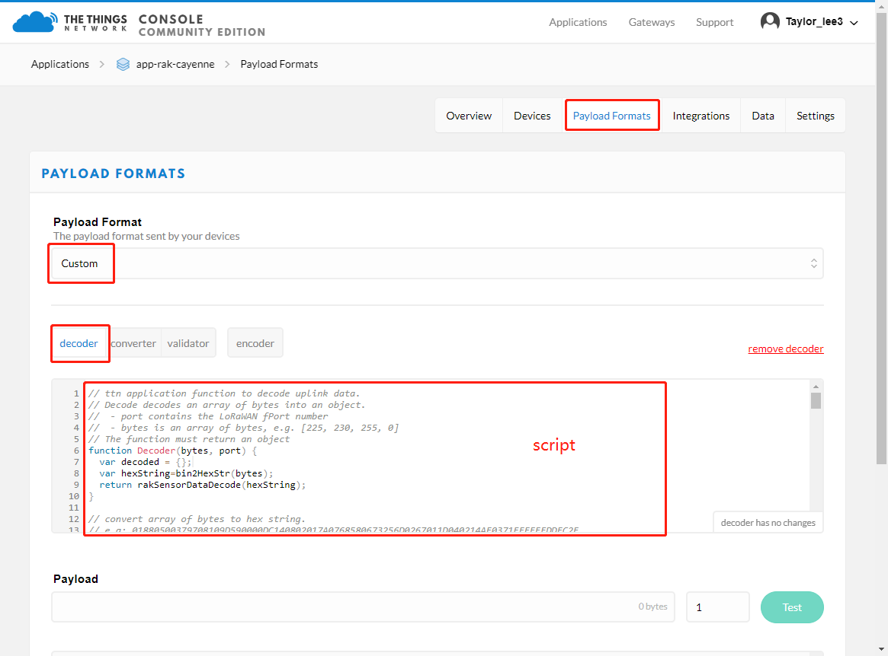
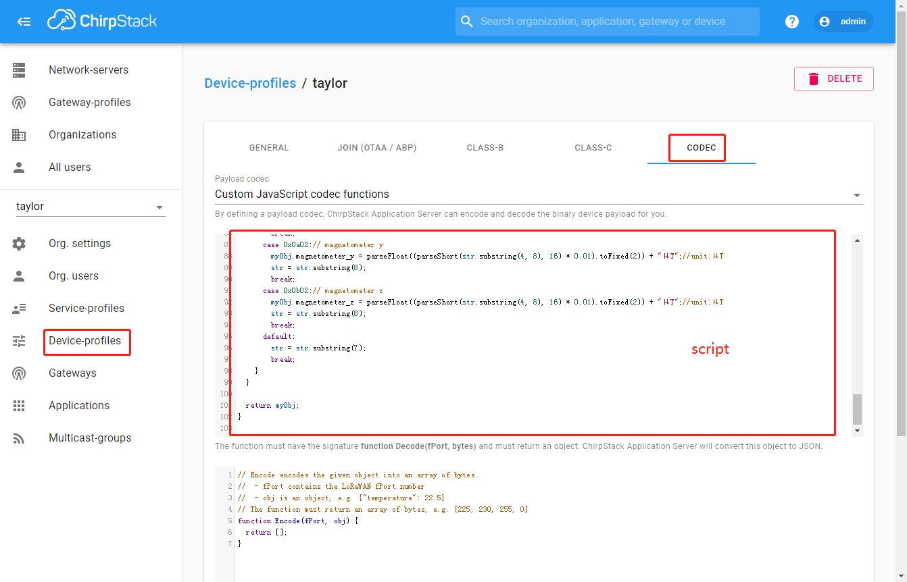
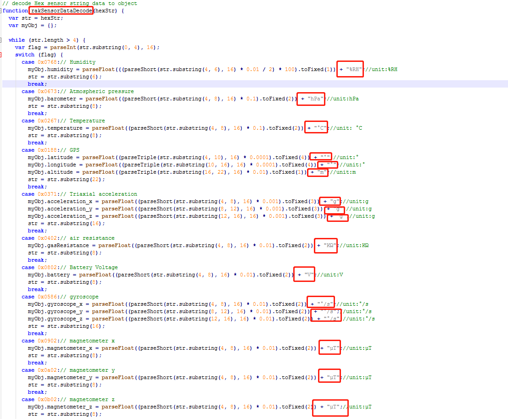
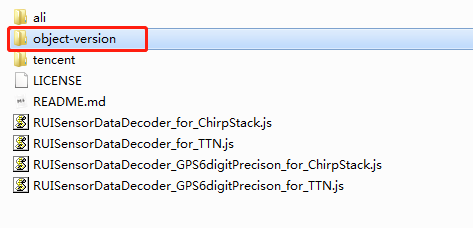

# RUI_LoRa_node_payload_decoder
This decoder can be used for all LoRa nodes which are built based on RUI.

There are two decoder in this repo, one is used for ChirpStack, and the other one is used for TTN.
These decoder can be used for all of RAK LoRa Node products like RAK5205/RAK7205, RAK7204, and RAK7200.

## Docoder script

### **TTN**

RUISensorDataDecoder_for_TTN.js

copy  content of RUISensorDataDecoder_for_TTN.js to the script area.

**the docoded data is as follow:**

{
  "acceleration_x": "-0.001g",
  "acceleration_y": "-0.035g",
  "acceleration_z": "-0.978g",
  "altitude": "563.4m",
  "barometer": "958.1hPa",
  "battery": "3.78V",
  "gasResistance": "52.95KΩ",
  "humidity": "44%RH",
  "latitude": "34.1911°",
  "longitude": "108.8857°",
  "temperature": "28.5°C"
}

### ChirpStack

RUISensorDataDecoder_for_ChirpStack.js

copy  content of RUISensorDataDecoder_for_ChirpStack.js to the script area.

**the docoded data is as follow:**

{
  "acceleration_x": "-0.001g",
  "acceleration_y": "-0.035g",
  "acceleration_z": "-0.978g",
  "altitude": "563.4m",
  "barometer": "958.1hPa",
  "battery": "3.78V",
  "gasResistance": "52.95KΩ",
  "humidity": "44%RH",
  "latitude": "34.1911°",
  "longitude": "108.8857°",
  "temperature": "28.5°C"
}

## Appendix

#### Note 1: 

**If you want get the data without unit, you can modify the script by delelte '+ "unit"' in function "rakSensorDataDecode",**

**e.g:**

**the docoded data is as follow:**

{
  "acceleration_x": "-0.001",
  "acceleration_y": "-0.035",
  "acceleration_z": "-0.978",
  "altitude": "563.4",
  "barometer": "958.1",
  "battery": "3.78",
  "gasResistance": "52.95",
  "humidity": "44",
  "latitude": "34.1911",
  "longitude": "108.8857",
  "temperature": "28.5"
}

#### **Note 2: **

**If you want the decoded data display in object as follow:**

{
  "DecodeDataHex": "0188053797109d5900dc140802017a0768580673256d0267011d040214af0371ffffffddfc2e",
  "DecodeDataObj": {
    "acceleration": {
      "x": "-0.001g",
      "y": "-0.035g",
      "z": "-0.978g"
    },
    "battery": "3.78V",
    "environment": {
      "barometer": "958.10hPa",
      "gasResistance": "52.95KΩ",
      "humidity": "44.0% RH",
      "temperature": "28.50°C"
    },
    "gps": {
      "altitude": "563.4m",
      "latitude": "34.1911°",
      "longitude": "108.8857°"
    }
  }
}

**please use the script in "object-version" directory**

#### Note 3: 

**If you increased the precison of gps data, please use**

RUISensorDataDecoder_GPS6digitPrecison_for_ChirpStack.js

RUISensorDataDecoder_GPS6digitPrecison_for_TTN.js

